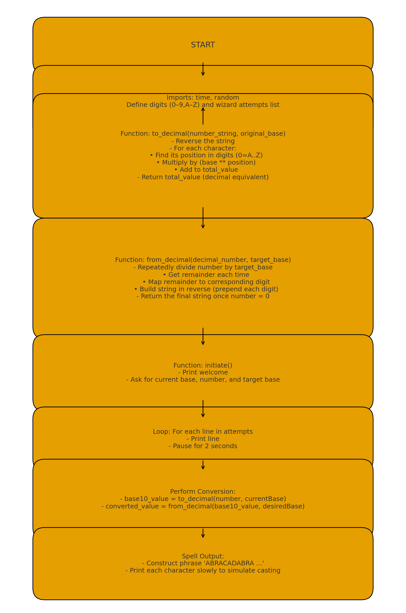

[](https://classroom.github.com/a/1Lpan6Kl)
[](https://classroom.github.com/open-in-codespaces?assignment_repo_id=21201420)

# The Hexorcist
Because using your brain \(or the internet \)is too hard!

 




## Requirements
* Python 3.x
* A keyboard

## Features
* Base Conversion using stick and stones
* Funny wizard man
* py test!!!!!!!!
* probaly more

## Examples

Basic usage:

```bash
python3 main.py
```

Basic test:
```bash
pytest test_main.py
```
## License
This project is public domain.
